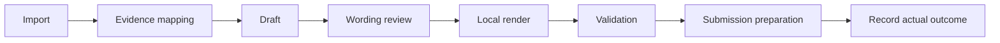

# Agentic workflow roadmap

Review and hardening: 2026-09-29. This document contains reusable proposals only.
Personal implementation choices, service contracts, evidence and task state belong
in the private repository. The Markdown vault remains the source of truth.

## Implemented in this hardening pass

- Privacy gate checks staged blobs, forbidden private index paths, filenames,
  staged document additions, symlinks and ignored working files in deep-audit mode.
- A versioned privacy pre-commit hook is enabled in this checkout; new clones
  must opt into it after checking for existing hooks. CI/release checks remain
  follow-up work because a local hook can be bypassed.
- Document output checks reject writes into the public workspace and escapes from
  private sources; personal baseline/extraction destinations in guides are corrected.
- Translation requires a reviewed model/provider policy, requests ZDR and denied
  data collection, disables fallback, keeps identity/contact blocks local, restores
  explicit redactions locally and suppresses remote error bodies.
- Cover-letter identity hydration keeps complete private drafts and signatures
  usable without passing identity through model-facing prose.
- The import skill no longer requires an unspecified memory graph or assumes a
  named project node. Knowledge retrieval starts small and expands as needed.
- Skills remain canonical and agent-agnostic under `.kilo/skills/`.
- The generic notebook agent directs private work and outputs to the private tree.
- Public handover and private task-state responsibilities are separated.

These controls are not a completed historical privacy audit or proof of an agent
account's controls. No plugin installation, external model call, submission or
history rewrite is part of this pass.

## Priority 0: complete operational privacy verification

| Work | Acceptance criterion |
| --- | --- |
| Publication audit | Audit all reachable Git history, filenames, commit messages, refs, binary metadata and public artifacts locally. Record categories and locations without copying values to public reports. Repair history only through a reviewed migration with backups and collaborator coordination. |
| Obsidian configuration | The vault, its `.obsidian/` configuration and its session state now live inside the private `JobSearch/` repository, so session writes no longer land in the public tree. Remaining: reopen the app and verify it does not recreate any `.obsidian/` state in the public project; keep shared settings in the vault. Do not assume Git ignores are access controls. |
| Agent privacy inventory | Verify each agent product, authentication route, model provider, memory backend, embeddings, tracing and connector. Record account-specific evidence privately. |
| Translation account checks | Test request restrictions with synthetic inputs; verify account logging/Broadcast, endpoint policies and regional requirements independently. Save fresh private verification evidence. |
| Binary release audit | Inspect ODT ZIP members, embedded maps, metadata, thumbnails and PDF/image content before publishing reusable assets. Pattern scanning alone cannot certify them. |
| Host storage audit | Review IDE state, transcripts, backups, temporary files, crash reports, sync and shell history. Configure retention/deletion without destroying unrelated data. |

The Obsidian vault is opened inside `JobSearch/`, so its configuration and
session state follow the vault folder and no configuration-folder override is
required. Reopen the app and verify no `.obsidian/` state is recreated in the
public project.
[Official configuration documentation](https://obsidian.md/help/configuration-folder).

OpenAI API retention controls are endpoint-specific and separate from third-party
MCP policies; they do not certify an agent session signed in through another
product. [Official data controls](https://developers.openai.com/api/docs/guides/your-data).

## Priority 1: consolidate workflow and validation

Reduce the root agent guide to durable invariants and a task-to-runbook index.
Migrate rules carefully rather than deleting them wholesale; preserve baseline
fidelity, factual provenance, language decisions and document review gates.
Keep each rule authoritative in one place, linked by skills and user guides.

Build a local CLI over Markdown before introducing another database. Suggested
operations: validate records, record submission, record interview, prepare task
context and inspect the pipeline. Validate dates, types, enums, links, duplicate
activity identities, missing research and illegal status transitions. Use atomic
writes, meaningful idempotency keys and a reviewable diff. Preserve compatibility
with an absent private repository. No personal data in public CI fixtures.

For alignment, make dropped prose and baseline fallbacks explicit acceptance
items. A render must not be accepted merely because the file exists. Track the
source/baseline version and accepted draft hash so stale outputs are detectable.
Local output-path checks do not replace a narrowly scoped filesystem sandbox.

## Priority 1: memory design

| Layer | Contract |
| --- | --- |
| Public instructions | Reusable procedures and synthetic examples only |
| Career evidence | Private source-backed Markdown; stable evidence IDs |
| Application history | Existing application/activity notes |
| Task state | Private handover; pending decisions and actual validation results |
| Retrieval index | Local, private, disposable and rebuildable from notes |
| Conversation | Working context with retention limits, not authoritative evidence |

For each experience, capture scope/ownership, outcome, source, experience date,
recorded date, confidence and externally appropriate wording. Distinguish direct
work, leadership, exposure and credentials. Keep user statements separate from
interpretation. Corrections supersede older claims without rewriting historical
applications automatically. Generated prose and job requirements are not evidence.

Retrieve Overview and evidence rules first, then relevant experience and gaps.
Start with text/full-text search. Add local embeddings only after measuring missed
relevant evidence; embeddings remain sensitive. A graph database is justified
only by recurring relationship queries that links/search cannot answer reliably.

On new evidence: deduplicate, record provenance, update affected synthesis and
identify documents that may need review. Do not silently propagate new claims.
Evaluate retrieval against synthetic questions and expected evidence IDs.

## Priority 2: routine skills

All skills live under `.kilo/skills/`; the folder name does not impose an agent
runtime. Agents should read this path directly when automatic discovery is absent.
Do not create divergent copies. The legacy external import skill should route to
this project skill or be retired deliberately in its owning environment; no global
skill installation was changed here.

| Proposed skill | Output and completion criterion |
| --- | --- |
| capture-career-evidence | Sourced experience/correction, updated gaps where warranted; no invented capabilities |
| record-application-event | Idempotent activity and warranted metadata changes; no inferred submission |
| prepare-application-documents | One baseline, evidence-linked small edits, language decision, CV and letter prose for review |
| validate-and-render-documents | Accepted draft mapped and locally rendered; no dropped text accepted silently; layout evidence retained |
| research-interview | Dated company/product/role briefing with sources, uncertainties and public professional interviewer context |
| prepare-interview | Likely questions, evidence-backed stories, questions for the employer and unresolved concerns |
| mock-interview | One question at a time; assess relevance, specificity, ownership and clarity; retain useful feedback only |
| interview-debrief | Separate statements from interpretation, capture commitments and new evidence, draft follow-up |
| positioning-review | Value proposition, proof points, honest gap wording and claim boundaries |
| offer-and-negotiation | Dated compensation evidence, total-compensation scenarios, private priorities and alternatives, counteroffer rehearsal |
| weekly-pipeline-review | Overdue actions, stale research, review queues and decisions; no automatic rejection for silence |
| privacy-preflight | Destinations, model routes, memory, logs and repository checks with explicit limits |

Each skill should name its trigger, inputs, allowed data routes, output, validation
and external-action boundary. Reuse PROCEDURES and templates rather than copying
schemas. Interview preparation should also test employer fit: authority, resources,
success measures, reporting relationships and actual expectations. Debriefs may
produce career evidence only when the user supplies substantive new facts.

Negotiation work must distinguish guaranteed pay, variable pay, equity assumptions,
benefits and working conditions. Keep reservation points and private constraints
out of external wording. Use current market sources and expose uncertainty; do
not invent competing offers, credentials or market figures. Specialist legal/tax
questions require appropriate current sources and professional review where needed.

## Priority 3: integrations, in small steps

| Candidate | Useful application | Conditions |
| --- | --- | --- |
| Gmail or Outlook Email | Selected recruitment threads and confirmations | Verify actual scopes; draft first; sending separately authorised |
| Google or Outlook Calendar | Interview dates and preparation context | Match the existing account; constrain retrieval and writes |
| Local AppMan MCP | Typed get_application, find_evidence and record_event tools | Path confinement, schema checks, minimal responses; local MCP is not local inference |
| Local Presidio | Supplement deterministic detection and tokenisation | Local recognizers; measure misses; no guarantee of anonymity |
| GitHub | Public engine issues and synthetic CI | Avoid unrelated/private repository access |
| Local transcription | Permitted recordings or dictated debriefs | Recording consent, local processing and retention agreed first |

Presidio supports local/custom detection but cannot find every sensitive entity.
[Official documentation](https://presidio.dataprivacystack.org/).

Defer Notion/Drive mirrors and extra CRMs until they solve a demonstrated problem.
Each duplicate store adds correction, deletion and access-control obligations.
Connector availability does not establish its permissions or account privacy.

## Priority 4: Jev validation and resumable orchestration

Implemented scaffold: [Jev checks](Jev-Checks.md) adds an advisory second fit
assessment after the existing analysis and independent coverage checks on final
Markdown CVs and letters. It includes editable requests, anonymous payload checks,
match/confidence reporting and synthetic contract tests. Live scoring accuracy,
calibration, account controls and cost/latency evaluation remain open.

Jev can classify narrow, atomic questions through Choice, Score and Noul. Suitable
experiments: requirement type, evidence support, change of claimed ownership, or
sanitised activity classification. It should not write career facts autonomously.
[Official primitives](https://docs.typesafe.ai/introduction).

Begin with synthetic labelled fixtures. Compare simple rules, the existing model
and Jev on errors, abstentions, latency and cost. Run advisory-only first. Choose
thresholds using held-out examples; structured answers are not proof of truth.
Keep the application policy deterministic: models cannot grant permission to send
private data, override a failed privacy gate or authorise submissions.

TypeSafe's published policy promises no training on inputs but describes retention
for business purposes and US hosting. No project-specific ZDR contract was verified.
Do not send full CVs, identities or conversation history for cloud compaction.
The requested anonymous checkpoints use the existing local privacy policy;
they do not authorise raw private transfers or establish account guarantees.
[TypeSafe privacy policy](https://typesafe.ai/legal/privacy-policy).

A useful advanced demonstration is a resumable state machine:

LangGraph can provide persistence and interruption/resumption if a small CLI is
insufficient. Keep checkpoints private/local, avoid raw-content cloud tracing,
and make every resumed side effect idempotent. Rendering approval must bind to
the actual draft version. Sending requires the actual recipient, content and
attachments to be reviewable; ambiguous network outcomes must not trigger blind
resends. [Persistence](https://docs.langchain.com/oss/python/langgraph/persistence),
[interrupts](https://docs.langchain.com/oss/python/langgraph/interrupts).

Use multiple agents only for genuinely independent tasks and only when authorised:
for example public company research and a separate evidence review. Supply minimal
context, use one writer for shared records, and never fork full private history
merely for convenience. Synthetic end-to-end demonstrations should measure factual
support, privacy failures, duplicate prevention and successful recovery.
